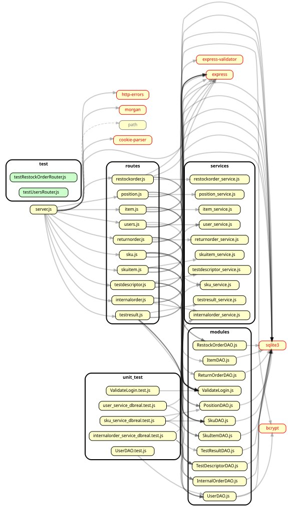

# Integration and API Test Report

Date: 20/5/2022

Version: 2 

# Contents

- [Dependency graph](#dependency graph)

- [Integration approach](#integration)

- [Tests](#tests)

- [Scenarios](#scenarios)

- [Coverage of scenarios and FR](#scenario-coverage)
- [Coverage of non-functional requirements](#nfr-coverage)

# Dependency graph 
 
 Due to the high dependency we used **Dependency cruiser** and
 **GraphViz** to generate and visualize our dependency graph in order to have a complete and accurate graph to insure consistent integration testing :

     
# Integration approach
 The integration approach that our team adopted is a **bottom up** approach testing :
   - The lowest layer is the data access object DAO which   have     been tested by the means of unit testing (White box and black box technique).
   - The second layer is the data transfer object DTO.
   - The third layer is the APIs which have been tested using the integration testing technique
    
Our team opted for an **incremental integration** strategy instead of designing mockups due to two reasons:

  - The components of the underlying layer has been completely tested  by the means of unit testing with the goal of obtaining a maximum coverage.This strategy makes the integration testing of the apis easier and faster because we are almost sure that the bottom layer functionalities are working as they should.
  -  The tightness of the time considering this is a limited time project made it extremely hard to mock each and every integration step considering that there are many dependencies between the modules.

# Integration Tests
 Jest test cases are in this folder code/server/unit_test.
 Here is an example of an integration test approach concerning the Internal Order classes.  
 The first step is  performing tests on the InternalOrderDAO.js  and UserDAO.js modules (see step 1) that we already reported in the Unit_test.md report. 
 Next is testing the internalorder_service_dbreal.test.js that depends on  UserDAO.js and InternalOrderDAO.js :the dependency can be shown in the beginning of the file defined by the key word required.(see step 2)

## Step 1

| Classes | mock up used | Jest test cases |
| ------- | ------------ | --------------- |
|UserDAO|NONE|testNewUser testGetAllUsers testGetUserInfo testGetAllUsers  testGetSuppliersTrue  testGetSuppliersFalse  testLogin testModifyRights ||    
        

## Step 2

| Classes | mock up used | Jest test cases |
| ------- | ------------ | --------------- |
| InternalOrderDAO.js  |     NONE     |  testNewInternalOrder   testEditInternalOrde|    

# API testing - Scenarios
Below are the senarios that have been defined in the official requirements documents and have been tested by our team by the means of api testing:

## Scenario UC 1-3 Modify SKU weight and volume

| Scenario |  Modify SKU weight and volume |
| ------------- |:-------------:| 
|  Precondition     | Manager M exists and is logged in |
|  | SKU S exists |
|  Post condition     | Weight and or volume of S updated |
| Step#        | Description  |
|  1    |  M searches S via ID |
|  2    |  M selects S's record |
|  3    |  M selects new value for S's weight |
|  4    |  M selects new value for S's volume |
|  5    |  M confirms the modifications |

## Scenario UC 2-4 Modify aisle ID, row and column of P

| Scenario |  Modify aisle ID, row and column of P |
| ------------- |:-------------:| 
|  Precondition     | Manager M exists and is logged in |
||Position P exists|
|  Post condition     | P's aisle ID, row and column updated |
| Step#        | Description  |
|  1    |  M selects position P |  
|  2    |  M defines new aisle ID for P |
|  3    |  M defines new row for P |
|  4    |  M defines new column for P |
|  5   |  M confirms the inserted data |
| 6 | System modify positionID |

## Scenario UC 3-1 Restock Order of SKU S issued by quantity

| Scenario |  Restock Order of SKU S issued by quantity |
| ------------- |:-------------:| 
|  Precondition     | Manager M exists and is logged in |
| | SKU S exists |
|  Post condition     | Restock Order RO exists and is in ISSUED state  |
| | S.availability not changed |
| Step#        | Description  |
|  1    | M creates order RO |
|  2    |  M fills quantity of item to be ordered | 
|  3    |  M select supplier SP that can sastisfy order | 
|  4    |  M confirms inserted data |  
|  5    |  RO is recorded in the system in ISSUED state |

## Scenario UC 4-1 Create users and define rights

| Scenario |  Create users and define rights |
| ------------- |:-------------:| 
|  Precondition     | Admin A exists and is logged in |
|  Post condition     |  Account X is created |
| Step#        | Description  |
|  1     |  A defines the credentials of the new Account  |  
|  2     | A selects the access rights for the new account X |
| 3      | A confirms the inserted data|

## Scenario UC 4-2  Modify user rights

| Scenario |  Modify user rights |
| ------------- |:-------------:| 
|  Precondition     | Admin A exists and is logged in |
|  | Account X exists |
|  Post condition     | X's rights updated |
| Step#        | Description  |
|  1    |  A selects account X  |
|  2    |  A selects the access rights for X |
|  3    |  A confirms the inserted data |

## Scenario 5-1-1 Record restock order arrival 

| Scenario |  Record restock order arrival  |
| ------------- |:-------------:| 
|  Precondition     | Clerk C exists and is logged in |
| | SKU S exists |
| | SKU position is valid |
| | Restock Order RO exists and is in DELIVERY state  |
|  Post condition     | RO is in DELIVERED  state  |
| | Each sku item has an RFID |
| Step#        | Description  |
|  1    |  RO arrives to the shop | 
|  2    | C records every item in the system with a new RFID | 
|  3    |  System stores RFID of SKU Items |
|  4    |  RO is updated in the system in DELIVERED state |

## Scenario 6-2  Return order of any SKU items 

| Scenario |  Return order of any SKU items |
| ------------- |:-------------:| 
|  Precondition     | Manager M exists and is logged in |
| | SKU S exists |
| | Restock order RO exists and is in state = COMPLETEDRETURN |
| | Restock order RO has at least 1 units of S that passed quality tests and need to be returned anyway |
|  Post condition     | Return Order REO registered into system  |
| | RFID for every SKU item returned is deleted |
| | Availability of sku and of position updated |
| Step#        | Description  |
|  1    |  M inserts RO.ID |
|  2    |  Return order starts |  
|  3    |  System provide RFID of SKU items that not passed quality tests |
|  4    |  System provide RFID of SKU items that passed quality tests but need to be returned (eg wrong order by manager) |
|  5    |  M adds all items to REO |
|  6    |  M confirms the inserted data |
|  7    |  System set all SKU items in state not available |
|  8    |  System update availability of SKU (decrease) and of position (increase) |
|  9    |  Supplier is notified by the system, REO is registered |

## Scenario 7-1  Login

| Scenario |  Login |
| ------------- |:-------------:| 
|  Precondition     | Account  for User U existing  |
|  Post condition     | U logged in  |
| Step#        | Description  |
|  1    |  User inserts his username |
|  2    |  User inserts his password |
|  3    |  User logged in,  system shows the functionalities offered by the access priviledges of  U |

# Coverage of Scenarios and FR

The following table is the coverage of the previous scenarios of some the official functional requirements as well as the name of the Mocha Tests corresponding to them.
You can find the functions in  the following folder:
code/server/test

| Scenario ID | Functional Requirements covered | Mocha  Test(s) | 
| ----------- | ------------------------------- | ----------- | 
|Scenario 4.1  | FR1.1                           | <ul> <li>newUser(expectedHTTPStatus, username, password, role, name, surname)</li> <li> getUser(expectedHTTPStatus, username, password, name, surname, role) </li></ul> |                     
|Scenario 4.2  | FR1.5                           |<ul> <li>editUser(expectedHTTPStatus, newType, oldType, username, password, role, name, surname)</li> </ul>|             
|Scenario 7.1  | FR1 (FR1.1)                         |<ul> <li>login(expectedHTTPStatus, username, password, role, name, surname))</li> </ul>| 
|Scenario 1.3  | FR2.1                         |<ul> <li>editSku(expectedHTTPStatus, weight, volume)</li> </ul>| 
|Scenario 2.4 | FR3.1.4                    |<ul> <li>editSku(expectedHTTPStatus, weight, volume)</li> </ul>| 
|Scenario 3.1 | FR5                 |<ul> <li>issueRO(expectedHTTPStatus, issueDate, products, supplierId)</li> </ul>| 
|Scenario 6.2| FR6.2             |<ul> <li>newReturnOrder(expectedHTTPStatus,returnDate, products, restockOrderId)</li> </ul>| 

# Tests according to the Change Request
| Classes that were modified by the CR | Mocha Test(s) |
|--------------------------------------|---------------|
| Item |  <ul> <li>testGETandDELETE(expectedHTTPStatus1, expectedHTTPStatus2)  </li> <li> testPOSTitem(itemBody)</li>  |
| RestockOrder | <ul> <li> POSTandPUTandGETtest(expectedHTTPStatus1, expectedHTTPStatus2, expectedHTTPStatus3) </li>  <li> testPOSTrestockOrder(roBody)</li> </ul> |
|  Sku & SkuItem| <ul> <li>  testPOSTskuItem(skuitemBody)</li><li>testPOSTsku(skuBody)</li></ul>|
|Return Order |<ul> <li>  testPOSTreturnOrder(returnOrderBody)</li> <li> testGETreturnOrder(){</li></ul>|

# Coverage of Non Functional Requirements

Here is a few non functional requirements that have been tested :

| Non Functional Requirement | Test name |
| -------------------------- | --------- |
| RFID is a string of 32 digits    | testSkuItem.js > test /api/skuitem |
|                                  | testSkuItem.js > test put /api/skuitems/:rfid |
|                                  | testSkuItem.js > test get /api/skuitems/:rfid (both correct and wrong case) |
|                                  | testSkuItem.js > test delete /api/skuitems/:rfid|
|                                  | testTestResults.js > test /api/skuitems/testResult |
|                                  | testTestResults.js > test get /api/skuitems/:rfid/testResults (both correct and wrong case) |
 |
| Date Format is YYYY/MM/GG HH:MM  | testRestockOrder.js > test put /api/restockOrder/:id/transportNote |
|                                  | testRestockOrder.js > test /api/restockOrders          |
|                                  | testSkuItem.js > test /api/skuitem |
|                                  | testSkuItem.js > test /api/skuitem |
|                                  | testSkuItem.js > test put /api/skuitems/:rfid |
|                                  | testReturnOrder.js > test post /api/returnOrder |
|                                  | testTestResults.js > test /api/skuitems/testResult |
|                                  | testTestResults.js > test put /api/skuitems/:rfid/testResult/:id |
|                                  | testInternalOrder.js > test post /api/internalOrders |
|                                  | testInternalOrder.js > test get /api/internalOrders |

