# Design Document 


Authors: Damiano Ferla, Giosuè Gisina, Eugenio Liotine, Maria Akl

Date: 27/04/2022

Version: 1.0


# Contents

- [High level design](#package-diagram)
- [Low level design](#class-diagram)
- [Verification traceability matrix](#verification-traceability-matrix)
- [Verification sequence diagrams](#verification-sequence-diagrams)

# Instructions

The design must satisfy the Official Requirements document 

# High level design 

EZWarehouse is a stand alone application for PC developed using the Javascript programming language. It utilises the Model View Controller (MVC) archtitectural pattern 
MVC with a layereed architecture, separating application data and logic.

EZWarehouse consisted of a 5 packages. EZWarehouse is the link between all packages. The Model package is described below in low level design. The GUI, Exceptions and Data packages are assumed to be provided, and the Data package is assumed to include the EZWarehouseInterface.js API.

The chosen design pattern is the Facade pattern, because the functionalities is provided by a group of classes.  


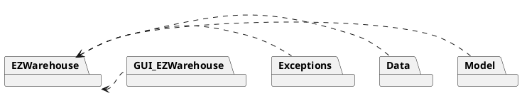

# Low level design

```plantuml
@startuml

interface EZWhInterface {

}
note top : The EZWh interface \ncontaining all its corresponding functions,\n each one having a relevant internal role.


class PositionDB {
    static int lastID = 0
    List<Position> positionDB
    +ArrayList<Position> get_positions()
    +void new_position(int posID, int aisleID, int row, int col, float maxWeight, float maxVolume)
    +void edit_position(int posID, int new_AisleID, int new_row, int new_col, float new_maxWeight, float new_maxVolume)
    +void change_position(int posID)
    +void delete_sku_item_by_position(int posID)
}

class Position {
    int positionID
    int aisle
    int row
    int col
    Float max_weight
    Float max_volume
    Float occupied_weight
    Float occupied_volume
    String SKUID
    ArrayList<SKUItem>  skuitems
 }

class SKU {
    int SKUID
    int positionID
    String description
    Float weight
    Float volume
    Float price
    String notes
    int availableQuantity
    ArrayList<SKUItem> availableItems
}

class SKUDB {
    static int lastSKUID = 0
    List<SKU> SKUDB
    +ArrayList<Sku> get_skus()
    +void create_sku(String description, float weight, float volume, String notes, float price, int qty)
    +void edit_sku(int skuId, String new_description, float new_weight, float new_volume, String new_notes, float new_price, int new_quantity)
    +void edit_position(int skuId, Position new_position)
    +void delete_sku(int skuId)
    
}

class SKUItem {
    int RFID
    Boolean available
    ArrayList<TestResult> results
}

class SKUItemDB {
    static int lastSKUID = 0
    List<SKUItem> SKUItemDB
    +ArrayList<SkuItem> get_all_skuItems()
    +ArrayList<SkuItem>  get_skuItems_by_sku(int skuId)
    +SkuItem get_SkuItem(int RFID)
    +void new_SkuItem(int RFID, int skuId, String date)
    +void edit_SkuItem(int new_RFID, bool new_available, String new_dateOfStock)
    +void delete_SkuItem(int RFID)
}

class InternalOrderDB {
    static int lastInternalOrderID = 0
    List<InternalOrder> internalOrderDB
    +ArrayList<InternalOrder> get_internal_orders()
    +ArrayList<InternalOrder> get_issued_internal_orders()
    +ArrayList<InternalOrder> get_accepted_internal_orders()
    +InternalOrder get_internal_order_by_ID(int intOrderId)
    +void create_internal_order(String issueDate, ArrayList<SkuItem> products, int customerId)
    +void edit_internal_order(int intOrderId, String newState, ArrayList<String>)
    +void delete_internal_order(int intOrderId)
}

class InternalOrder{
    int intOrderID
    String date
    String state
    ArrayList<SKU> SKUorder
}

class InventoryCatalogue{
  ArrayList<SKU>  availableSkus
}

class TestResult {
    int resultID
    String date
    Boolean result
}

class TestResultDB{
    static int lastID = 0
    List<TestResult> testResultDB
    +ArrayList<TestResult> get_testResults(int RFID)
    +TestResult get_testResult_by_ID(int RFID, int testID)
    +void create_testResult(int RFID, int testID, String Date, bool result)
    +void set_testResultBy_ID(int RFID,int testID, String Date, bool result)
    +void delete_TestResult_By_ID(int RFID, int testID)
}


class TestDescriptor {
    int descriptorID
    String testname
    String procedureDescrip
    ArrayList<TestResult> results
}

class TestDescriptorDB {
    static int lastTestID = 0
    List<TestDescriptor> TestDescriptorDB
    +ArrayList<TestDescriptor> get_TestDescriptors()
    +TestDescriptor get_TestDescriptor_By_ID(int testID)
    +void create_Test_Descriptor(String name, String procedureDescription, int skuId)
    +void set_TestDescriptor_By_Id(int testID, String name, String procedureDescription, int skuId)
    +void delete_TestDescriptor_By_ID(int testID)
}

class DateOfStock {
    String RFID
    String positionID
    Date dateOfStock
}

class UserDB{
    static int lastID=0
    List<User> userDB
    +User get_user_info()
    +ArrayList<User> get_suppliers()
    +ArrayList<User> get_users()
    +void create_newUser(String username, String name, String surname, String password, String role)
    +ArrayList<String> login_user(String username, String password)
    +bool logout_user()
    +void edit_userRights(String username, String oldRole, String newRole)
    +void delete_user_by_username_and_type(String username, String type) 
}

class User {
    int userID
    String username
    String password
    String role
    String name
    String surname
    String email
}

class RestockOrderDB{
    static int lastRestockOrderID = 0
    List<RestockOrder> restockOrderDB
    +ArrayList<RestockOrders>get_restock_orders()
    +ArrayList<RestockOrders>get_issued_restock_orders()
    +RestockOrders get_restock_order_by_id(int restockOrderId)
    +ArrayList<SkuItem> get_restock_orders_items(int restockOrderId)
    +void create_new_restock_order(String issueDate, ArrayList<SkuItem> products, int supplierId)
    +void edit_restock_order(int restockOrderId, String newState)
    +void add_sku_to_restock_order(int restockOrderId, ArrayList<SkuItem>)
    +void add_transport_note_to_restock_order(int restockOrderId, ArrayList<transportNote>)
    +void delete_restock_order(int restockOrderId)
}

class RestockOrder{
    int restockID
    String issueDate
    String status
    HashMap <Item,Integer> RestockQty
    String transportNote
    int userID
    int supplierID
    int returnID
    ArrayList<String> itemIDToRestock
}

class ReturnOrder{
    int returnID
    Date returndate
    int restockID
    ArrayList<SKUItem> itemsToReturn
}

class ReturnOrderDB{
static int lastReturnOrderID = 0
    List<ReturnOrder> ReturnOrderDB
+ArrayList<ReturnOrders>get_ReturnOrders()
    +ReturnOrders get_ReturnOrder_By_Id(int returnOrderId)
    +void create_New_ReturnOrder(String returnDate, ArrayList<SkuItem> products, int restockOrderId)
    +void delete_ReturnOrder(int returnOrderId)
}

class TransportNote {
    int noteID
    int restockID
    Date shipmentDate 
}

class Data {
    PositionDB positionDB
    SkuDB skuDB
    SkuItemDB skuItemDB
    InternalOrderDB internalOrderDB
    RestockOrderDB restockOrderDB
    TestDescriptorDB testDescriptorDB
    TestResultDB testResultDB
    UserDB userDB
    ItemsDB itemsDB
}

class Supplier{
    int supplierID
    String name
    String adress
    ArrayList<Item> itemsOnSale
}

class Item {
    int itemID
    String description
    String price
    int skuID
    int supplierID
}

class ItemDB {
    static Integer lastItemID = 0
    List<Item> ItemDB
    +ArrayList<Item> get_Items()
    +Item get_Item(int itemID)
    +void new_Item(String description, float price, int skuID, int supplierID)
    +void edit_Item(String itemID, String newDescription, float newPrice)
    +void delete_Item(String itemID)
}

class Customer{
    int customerID
    String name
    String surname
}



' Relations
PositionDB "1"--"*" Position
SKUItemDB "1"--"*" SKUItem
TestResultDB "1"--"*" TestResult
TestDescriptorDB "1"--"*" TestDescriptor
UserDB "1"--"*" User
SKUDB "1"--"*" SKU
ItemDB "1"--"*" Item
InternalOrderDB "1"--"*" InternalOrder
RestockOrderDB "1"--"*" RestockOrder
ReturnOrderDB "1"--"*" ReturnOrder

User "1"--"*" RestockOrder
RestockOrder "*"--"1" Supplier
RestockOrder "1"--"0-1" TransportNote
RestockOrder "1"--"*" Item
RestockOrder "1"--"0-1" ReturnOrder
Item "*"--"1" Supplier
RestockOrder "1"--"*" SKUItem
Item "*"--"1" SKU
ReturnOrder "0-1"--"*" SKUItem
InternalOrder "0-1"--"*" SKUItem
InternalOrder "0-1"--"*" SKU
InventoryCatalogue "1"--"*" SKU
SKU "1"--"*" SKUItem
SKU "*"--"*" TestDescriptor
TestDescriptor "1"--"*" TestResult
SKU "1"--"1" Position
SKUItem "1"--"*" TestResult
SKUItem "*"--"0-1" Position
DateOfStock"1"--"1" SKUItem
DateOfStock"1"--"1" Position
Customer "1"--"*" InternalOrder

Data "1"--"1" EzWH
Data "1"--"1" PositionDB
Data "1"--"1" SKUDB
Data "1"--"1" SKUItemDB
Data "1"--"1" InternalOrderDB
Data "1"--"1" RestockOrderDB
Data "1"--"1" TestDescriptorDB
Data "1"--"1" TestResultDB
Data "1"--"1" UserDB
Data "1"--"1" ItemDB
Data "1"--"1" ReturnOrderDB


EZWhInterface <|- EzWH


@enduml
```

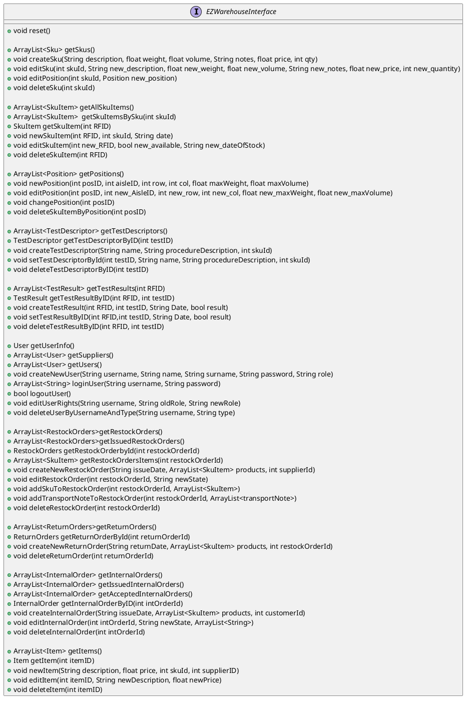

# Verification traceability matrix

|  | PositionDB | SKUDB | SKUItemDB | InternalOrderDB | TestDescriptorDB | TestResultDB | UserDB | ItemDB | RestockOrderDB | ReturnOrderDB |  Customer | Supplier | TransportNote |  
|--|:-----------|-------|-----------|-----------------|------------------|--------------|--------|--------|----------------|---------------|-----------|----------|---------------|
|FR1|           |       |           |                 |                  |              |   X    |        |                |               |           |    X     |               |
|FR2|           |   X   |    X      |                 |                  |              |        |        |                |               |           |          |               |
|FR3|  X        |       |           |                 |        X         |      X       |        |        |                |               |           |          |               |
|FR4|           |       |           |                 |                  |              |        |        |                |               |   X       |          |               |
|FR5|           |  X    |           |                 |       X          |      X       |        |        |       X        |     X         |           |   X      |      X        |
|FR6|           |    X  |    X      |     X           |                  |              |        |        |                |               |           |          |               |
|FR7|           |       |           |                 |                  |              |        |  X     |                |               |           |          |               |

# Verification sequence diagrams 

## UC 1.1
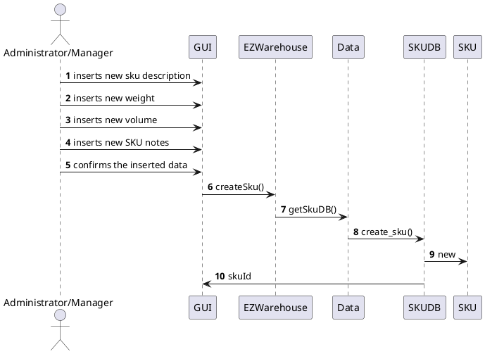

## UC 1.3
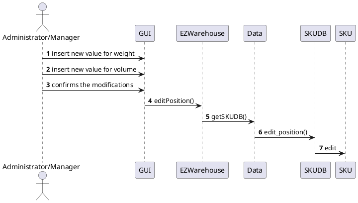

## UC 2.1
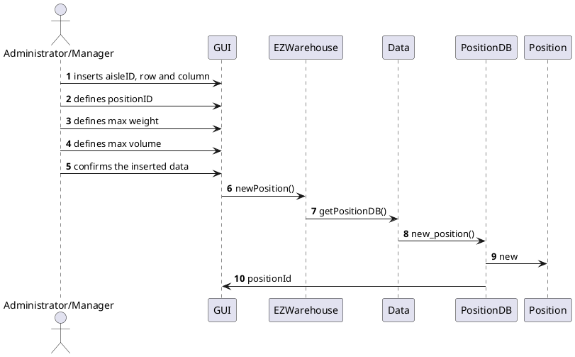

## UC 2.3
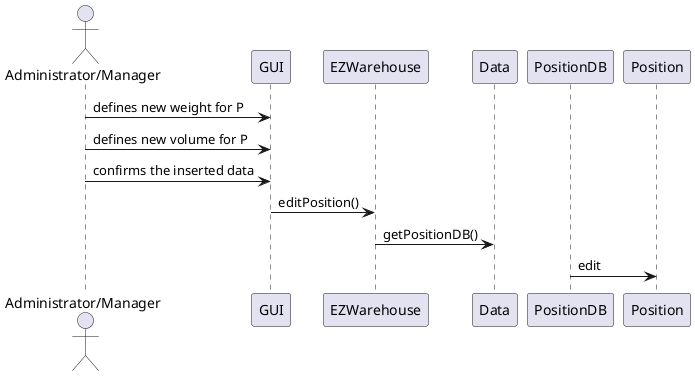

## UC 2.4
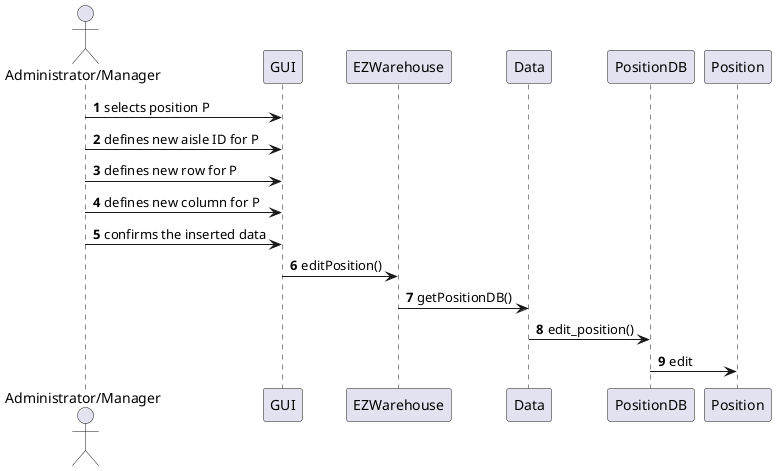

## UC 2.5
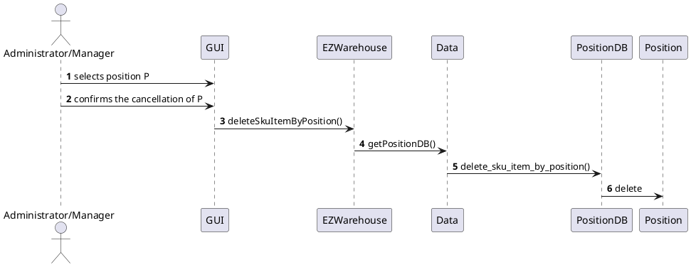

## UC 3.1
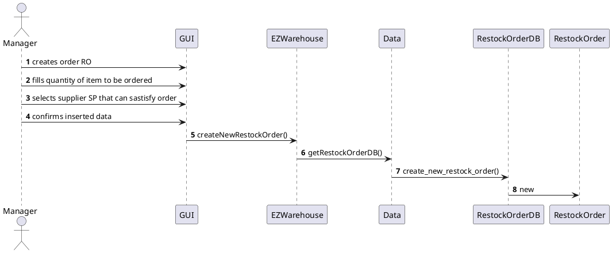

## UC 4.1
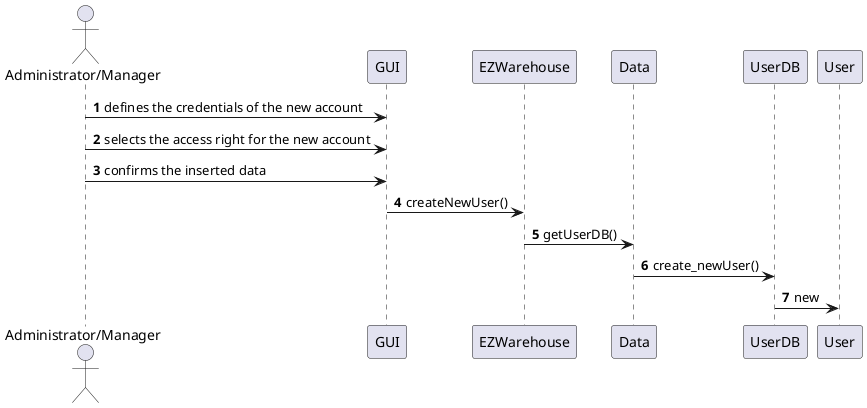

## UC 4.2
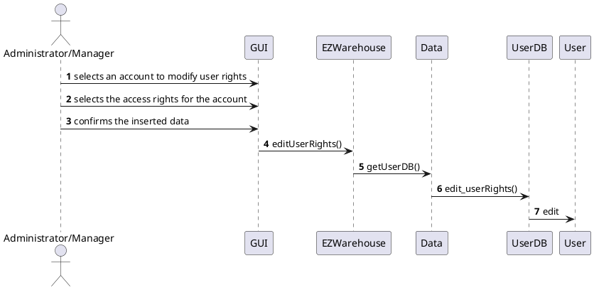

## UC 4.3
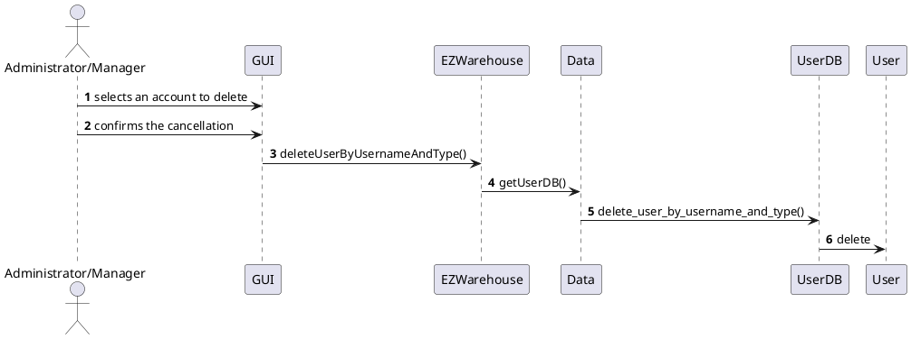

## UC 5.1.1
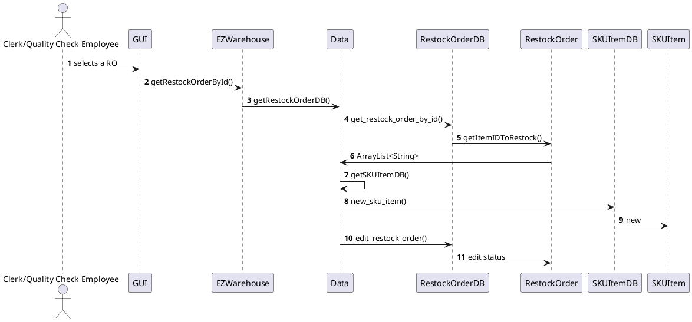

## UC 5.2.1
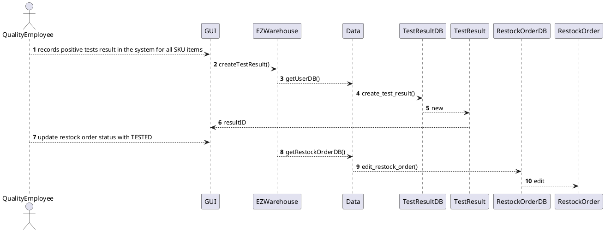

## UC 6.1
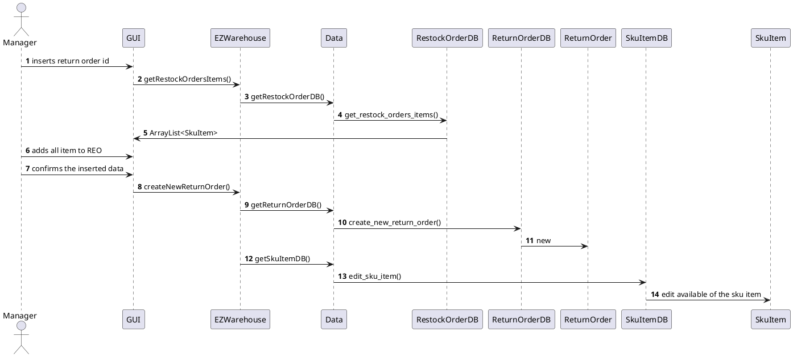

## UC 7.1
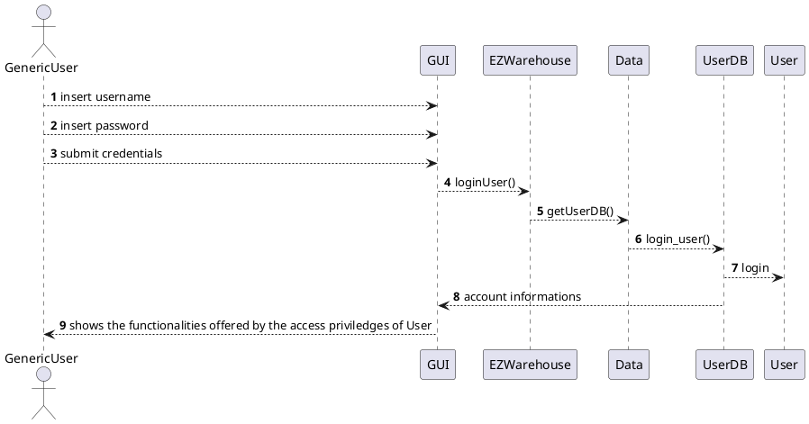

## UC 7.2
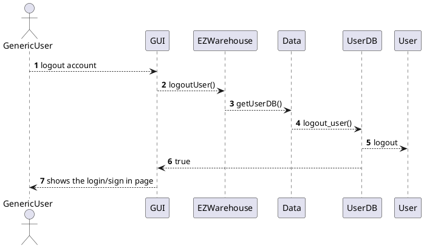

## UC 11.1
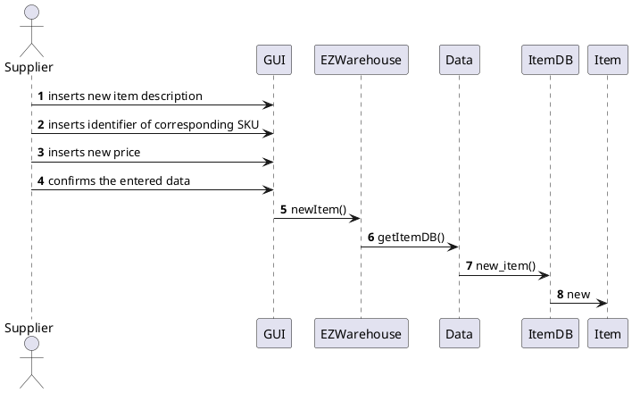

## UC 12.1
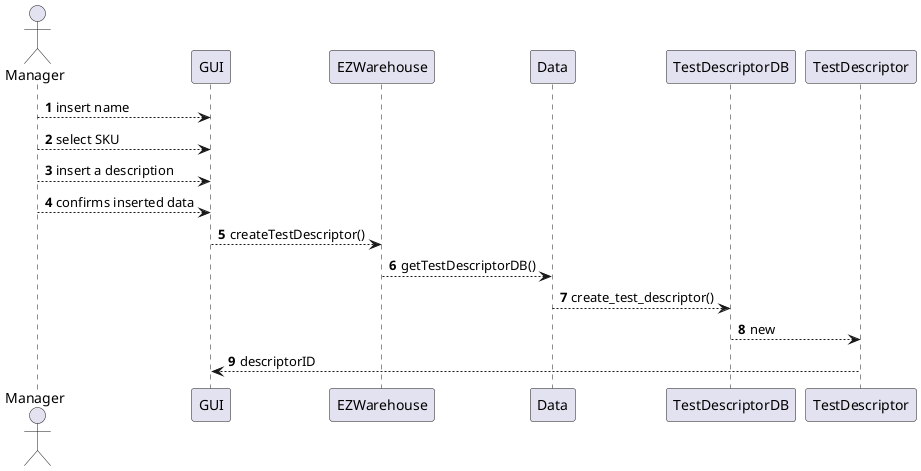

## UC 12.2
```plantuml
@startuml UC12.2
actor "Manager"
autonumber
"Manager" --> GUI : select test description
"Manager" --> GUI : insert new procedure description
"Manager" --> GUI : confirms updated data
GUI --> EZWarehouse : setTestDescriptorByID()
EZWarehouse --> Data : getTestDescriptorDB()
Data --> TestDescriptorDB : set_test_descriptor_by_ID()
TestDescriptorDB --> TestDescriptor : edit
@enduml
```

## UC 12.3
```plantuml
@startuml UC12.3
actor "Manager"
autonumber
"Manager" --> GUI : select test description
"Manager" --> GUI : confirms cancellation
GUI --> EZWarehouse : deleteTestDescriptorByID()
EZWarehouse --> Data : getTestDescriptorDB()
Data --> TestDescriptorDB : delete_test_descriptor_by_ID()
TestDescriptorDB --> TestDescriptor : delete
@enduml
```
