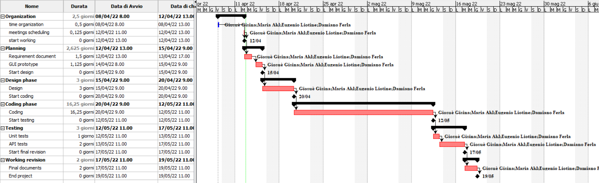

# Project Estimation  
Date: 08 April 2022

Version:1.0

# Estimation approach
Consider the EZWH  project as described in YOUR requirement document, assume that you are going to develop the project INDEPENDENT of the deadlines of the course
# Estimate by size
### 
|             | Estimate                        |             
| ----------- | ------------------------------- |  
| NC =  Estimated number of classes to be developed | 18 |   
|  A = Estimated average size per class, in LOC | 300 | 
| S = Estimated size of project, in LOC (= NC * A) | 5400 |
| E = Estimated effort, in person hours (here use productivity 10 LOC per person hour) | 540 |   
| C = Estimated cost, in euro (here use 1 person hour cost = 30 euro) | 16200€ | 
| Estimated calendar time, in calendar weeks (Assume team of 4 people, 8 hours per day, 5 days per week ) |3 weeks|               

# Estimate by product decomposition
### 
|         component name    | Estimated effort (person hours)   |             
| ----------- | ------------------------------- | 
|requirement document    | 48 |
| GUI prototype | 36 |
|design document | 32 |
|code | 540 |
| unit tests | 10 |
| api tests  | 40 |
| management documents  | 80 | 

# Estimate by activity decomposition
### 
|         Activity name    | Estimated effort (person hours)   |             
| ----------- | ------------------------------- |
| Organization | 18 |
| Planning | 84 |
| Design phase | 96 |
| Coding phase | 520 |
| Testing | 96 |
| Working revision | 64 |
###

# Summary

One of the possibile reasons about the difference between the three estimation is because the "size" methodology is less detailed as the "activity" decomposition. In fact, in the activity decomposition are considered more activities, causing an increase of the estimation too.

|             | Estimated effort                        |   Estimated duration |          
| ----------- | ------------------------------- | ---------------|
| estimate by size | 540 | 3 weeks |
| estimate by product decomposition | 786 | 5 weeks |
| estimate by activity decomposition | 878 | 5 weeks |

