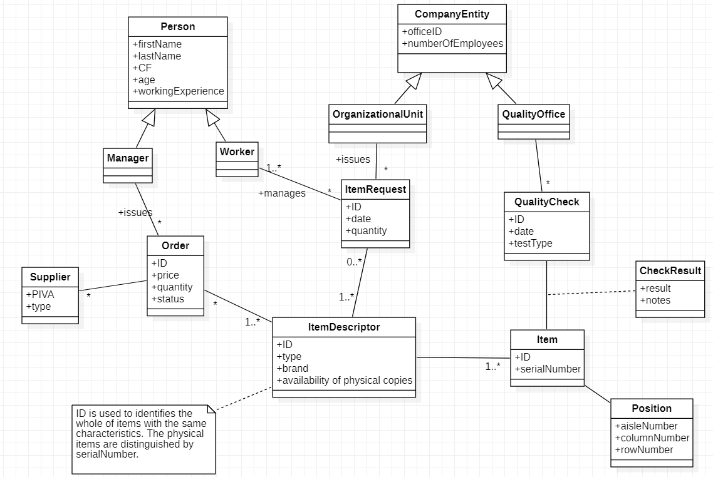

 #Requirements Document 
 #Requirements Document 

Date: 12 April 2022

Version: 1.0

 
| Version number | Change |
| ----------------- |:-----------|
| | | 

# Contents

- [Informal description](#informal-description)
- [Stakeholders](#stakeholders)
- [Context Diagram and interfaces](#context-diagram-and-interfaces)
	+ [Context Diagram](#context-diagram)
	+ [Interfaces](#interfaces) 
	
- [Stories and personas](#stories-and-personas)
- [Functional and non functional requirements](#functional-and-non-functional-requirements)
	+ [Functional Requirements](#functional-requirements)
	+ [Non functional requirements](#non-functional-requirements)
- [Use case diagram and use cases](#use-case-diagram-and-use-cases)
	+ [Use case diagram](#use-case-diagram)
	+ [Use cases](#use-cases)
    	+ [Relevant scenarios](#relevant-scenarios)
- [Glossary](#glossary)
- [System design](#system-design)
- [Deployment diagram](#deployment-diagram)

# Informal description
Medium companies and retailers need a simple application to manage the relationship with suppliers and the inventory of physical items stocked in a physical warehouse. 
The warehouse is supervised by a manager, who supervises the availability of items. When a certain item is in short supply, the manager issues an order to a supplier. In general the same item can be purchased by many suppliers. The warehouse keeps a list of possible suppliers per item. 

After some time the items ordered to a supplier are received. The items must be quality checked and stored in specific positions in the warehouse. The quality check is performed by specific roles (quality office), who apply specific tests for item (different items are tested differently). Possibly the tests are not made at all, or made randomly on some of the items received. If an item does not pass a quality test it may be rejected and sent back to the supplier. 

Storage of items in the warehouse must take into account the availability of physical space in the warehouse. Further the position of items must be traced to guide later recollection of them.

The warehouse is part of a company. Other organizational units (OU) of the company may ask for items in the warehouse. This is implemented via internal orders, received by the warehouse. Upon reception of an internal order the warehouse must collect the requested item(s), prepare them and deliver them to a pick up area. When the item is collected by the other OU the internal order is completed. 

EZWH (EaSy WareHouse) is a software application to support the management of a warehouse.

# Stakeholders

| Stakeholder name  | Description | 
| ----------------- |:-----------:|
| Company | Owner of EZWH - Association of organizational units of which the warehouse is part of - Demanding for a software application | 
| Retailer | Owner of EZWH - Association of organizational units of which the warehouse is part of - Demanding for software application |
| Supplier | Supplier of EZWH - Supplies the shop with items |
| Inventory and Catalogue System| Physical (and virtual) place where item are stored - Used to manage sales |
| Manager | Manages inventory at the warehouse. He supervises the availability of items. He issues an order to a supplier |
| Quality office | Office that performs random quality checks on items |
| Organizational units | Part of the company that asks for items in the warehouse via internal orders |
| Item | Items handled by warehouse | 
| Warehouse workers | Person who works at the warehouse. He places the items in the right warehouse areas and updates items in inventory and catalogue systems | 
| Software manager | A person inside the company who manages the software |
| Software developer | Designs and develops the software |
| Mail system | Software that manages interactions between internals and externals departements |

## Context Diagram

## Interfaces

| Actor | Logical Interface | Physical Interface  |
| ------------- |:-------------:| -----:|
| Manager | GUI | Screen, keyboard, mouse, PC  |
| Warehouse worker| GUI | Screen, keyboard, mouse, PC |
| Quality office | GUI | Screen, keyboard, mouse, PC |
| Software Manager | GUI | Screen, keyboard, mouse, PC |
| Organizational unit | GUI | Screen, keyboard, mouse, PC |
| Supplier | mail user agent | Internet Network |
| Inventory and catalogue system | custom API | Application / Database link |
| Payment system | API for online payments | Internet Network |
| Mail system | Webmail client | Mail gateway / Internet Network |

# Stories and personas
* Sally, an Italian woman from Sicily, aged 35 with a degree in management is the manager of the warehouse.
She is very organized and  is also very ponctual.
In her job, she has to deal with many suppliers choices and  place many orders during the day. Sally forgets a lot and  that is why she likes to keep a list of the orders.
Sally hates the complexity in the payment procedures as she gets anxious when it comes to money of the company and hates being interrupted when she is making the payment which of course happens a lot because she is the manager.

* George an American aged 25, is a worker in the quality office and is a very attentive worker as he inspects every object and makes a decision on either to reject or not the object base on its qualifications.
However, George has basic knowledge with the pc and often gets lost if the system is too complicated. 

* Pierre a 27 French guy is a worker in the warehouse. He is responsible in the allocations of items in the correct place after they undergo quality checks, but is very impatient as he is always hungry and rushed to go home early to eat dinner with his family.
He gets distracted a lot by his phone and often forgets to upgrade the catalogue system once items are added or removed.

* Josie a short 24 low income software manager of the company, is responsible of managing the application user account of the company by keeping track of the users and updating regularly all their information.

* Matheo a 40 year old Italian manager of the internal organization unit of the company is impatient and likes to recieve the orders he places very fast. He hates using software and often forget items that he should have placed in the order.

# Functional and non functional requirements

## Functional Requirements

| ID |       | 	|  |   |Description  |
| ---|---- |----|----|----| :-------------:| 
|  FR1  |  | | | |Authorize and authenticate |
|  |FR1.1 | | || Login |
|  |FR1.2 | | || Logout |
|  |FR1.3 | | || Reset password |
| FR2 | | | || Manage application user account |
|  | FR2.1 | | ||  Create a new account |
|  | FR2.2 | | ||  Delete an account |
| |FR2.3  | | || View user Profile |
|  | FR2.4 | | || Edit user information | 
| FR3 |  | | || Manager actions |
|  | FR3.1 | | || Manage new orders |
|  | |FR3.1.1 | || Select a supplier from the list |
|  | || FR3.1.1.1 || Select items (in short supply) |
|  | |FR3.1.2 | | |Search an item |
| | |FR3.1.3 | | |Show Orders |
| | ||FR3.1.3.1 | |Allow reorder of previous orders |
| | ||FR3.1.3.2 | |Allow canceling of an order |
| | |FR3.1.4 | | |Place the order for those items |
| | |FR3.1.4.1 | | |Process a credit card payment through credit card online system and payment gateway API |
| | FR3.2   | | | |Manage suppliers |
|  | |FR3.2.1 | | |Add a new supplier to Supplier's list |
|  | |FR3.2.2 | | |Remove a supplier from Supplier's list |
|  | |FR3.2.3 | | |Edit supplier information from Supplier's list |
|  | |FR3.2.4 | | |Manage commercial documents for each Supplier | 
|  | | | FR3.2.4.1| |Upload and store commercial documents for each Supplier | 
|  | | ||FR3.2.4.1.1  |Browse file from the system | 
|  | ||FR3.2.4.2  | |Delete already uploaded commercial documents from a specific Supplier | 
|   FR4| | | | |Check quality of an order|
|  | FR4.1 || | |Apply filters to the search |
|  |FR4.2| | | |View Items present in the order for quality checking|
|  || FR4.2.1| | |Change item quality status |
|  | || FR4.2.1.1|  |Change item quality status in 'Approved'|
|  | || FR4.2.1.2|  |Change item quality status in 'Rejected'|
| FR5 | | || |Warehouse worker actions |
|  | FR5.1 || | | Apply filters to the search |
|  |FR5.2| || |  Update catalogue system  |
|  |FR5.3| || |  Optimize Space  |
|  |     | FR 5.3.1 ||| Remove items from catalogue systems that are no longer in the warehouse |
|  |FR5.4| || |  Requested Items  | 
|  |     | FR 5.4.1 | |  | Change status in 'Collected' |
|  |     | FR 5.4.2 | |  | Change status in 'Prepared' |
|  |     | FR 5.4.3 | |  | Change status in 'Delivered' |
|  | FR5.5 || | | Manage Items inside the catalogue system |
|  | |FR5.5.1 ||  | Insert order in the proper storage location |
|  | ||FR5.5.1.1 |  | Select Quantity |
|  | ||FR5.5.1.2 |  | Select Storage Location |
|  | ||FR5.5.1.3 |  | Select Position |
|  | ||FR5.5.1.4 | |  Check Location availability for Item storage |
| FR6 | | | ||  Software Developer actions |
| |FR6.1  | | | | Set user Role |
| |FR6.2  | | | | Change user Role |
| |FR6.3  | | | | View user Profile |
| FR7 | | | | | OU Actions |
| |FR7.1  | | | | Place a request for items |

## Non Functional Requirements

| ID        | Type (efficiency, reliability, ..)           | Description  | Refers to |
| ------------- |:-------------:| :-----:| -----:|
|  NFR1     |Efficiency | Response:time <0.5 sec for all functions | ALL |
|  NFR2     |Efficiency| Memory: Ram <0.5 Gbyte | ALL |
|  NFR3     |Privacy|No personal data should be diclosed to anyone else except owner, software developer and authorised role| FR1, FR3,FR6|
|  NFR4     |Privacy | Payment information and sensitive data are to be well protected | FR3.1.4.1 |
| NFR5 | Usability | System should be user friendly to use and not too complex | ALL
| NFR6 |Correctness| Capability to upgrade the status of the item from the checked catalogue to the database if the item passed the quality check | FR4.2 - FR4.2.1.2 |
| NFR7 | Portability|Application should be compatible with devices of employees(Manger,Workers) | ALL
| NFR8 | Reliability|Failure of the system every two month. The system must maintain a backup of the database of items | ALL
| NFR9 |Robustness|Time to restart after failure <30 sec | ALL
| NFR10 |Maintainability|Space of the database must be large enough to host more than 10000 items and easily expanded if required | FR5.2-FR 5.3.1,FR6|
| NFR11 |Currency|The currency of the order payment is euro | FR3.1.4.1 |
| NFR12 |Security|The system should be safe from malicious external access | ALL | 

# Use case diagram and use cases

## Use case diagram

### Use case 1, UC1 - Login
| Actors Involved        | Manager, Warehouse worker, Quality office, Organizational unit, Software manager |
| ------------- |:-------------:| 
|  Precondition     | The user must have an account |
|  Post condition     | The user is successfully logged |
|  Nominal Scenario     | The user insert e-mail; the actor insert password; the user logins and he's successfully authenticated |
|  Variants     | NONE |
|  Exceptions     | The user type a wrong e-mail and/or password |

##### Scenario 1.1 

| Scenario 1.1 | |
| ------------- |:-------------:| 
|  Precondition     | The user must have an account |
|  Post condition     | The user is successfully logged |
| Step#        | Description  |
|  1     | The user write his correct e-mail in the correct field |  
|  2     | The user write his correct password in the correct field |
|  3     | The user logins |
|  4     | The user is successfully logged |

##### Scenario 1.2 
| Scenario 1.2 | |
| ------------- |:-------------:| 
|  Precondition     | The user must have an account |
|  Post condition     | The user failed the login procedure |
| Step#        | Description  |
|  1     | The user write his maybe uncorrect e-mail in the correct field |  
|  2     | The user write his maybe uncorrect password in the correct field |
|  3     | The user logins |
|  4     | The app pops up a message error |
|  5     | The user restarts from STEP 1 |

### Use case 2, UC2 - Logout

| Actors Involved        | Manager, Warehouse worker, Quality office, Organizational unit, Software manager |
| ------------- |:-------------:| 
|  Precondition     | The user must have an account successfully logged in |
|  Post condition     | The user is successfully logged out |
|  Nominal Scenario     | The user click a button and he's able to log out from the application |
|  Variants     | NONE |
|  Exceptions     | NONE |

##### Scenario 2.1 

| Scenario 2.1 | |
| ------------- |:-------------:| 
|  Precondition     | The user must have an account successfully logged in |
|  Post condition     | The user is successfully logged out |
| Step#        | Description  |
|  1     | The user logs out |  
|  2     | The user is successfully logged out |

### Use case 3, UC3 - Reset Password

| Actors Involved        | Manager, Warehouse worker, Quality office, Organizational unit, Software manager |
| ------------- |:-------------:| 
|  Precondition     | The user must have an account |
|  Post condition     | The user has a new password |
|  Nominal Scenario     | The user needs to reset his password, so he has to click on the link provided from the email and finally he can complete a form with a new password |
|  Variants     | NONE |
|  Exceptions     | NONE |

##### Scenario 3.1 

| Scenario 3.1 | |
| ------------- |:-------------:| 
|  Precondition     | The user must have an account |
|  Post condition     | The user has a new password |
| Step#        | Description  |
|  1     | The user goes to the reset password page |  
|  2     | It will be generate an automatic email to create a new password |
|  3     | The user compile the form with the new password |
|  4     | The user confirm the new password writing again the new password | 

### Use case 4, UC4 - Register a new user
| Actors Involved        | Manager, Warehouse worker, Quality office, Organizational unit, Software manager |
| ------------- |:-------------:| 
|  Precondition     | The user must have the app |
|  Post condition     | The user has a new account |
|  Nominal Scenario     | The user create a new account compiling a form, then he will confirm the account clicking on a link sent by email  |
|  Variants     | NONE |
|  Exceptions     | The user type a wrong password, the user type a wrong email  |

##### Scenario 4.1 

| Scenario 4.1 | |
| ------------- |:-------------:| 
|  Precondition     | The user must have the app |
|  Post condition     | The user has a new account |
| Step#        | Description  |
|  1           | The user goes to the register page |
|  2           | The user fill the form with his personal information |
|  3           | The user fill the email input text with his (correct) email |
|  4           | The user fill the password input text with a password |
|  5           | The password matches the constraint (Longer than 7 chars, with at least one number and one special letter)
|  6           | The user sends the form |
|  7           | An auto-generated link is sent by email to confirm the account |
|  8           | The user click on the link and his account is successfully created |

##### Scenario 4.2

| Scenario 4.2 | |
| ------------- |:-------------:| 
|  Precondition     | The user must have the app |
|  Post condition     | The user fail the registration procedure |
| Step#        | Description  |
|  1           | The user goes to the register page |
|  2           | The user fill the form with his personal information |
|  3           | The user fill the email input text with his (correct) email |
|  4           | The user fill the password input text with a password |
|  5           | The password don't match the constraint (Longer than 7 chars, with at least one number and one special letter)
|  6           | The user sends the form |
|  7           | The user fails the registration procedure and it will pop up an error message |

##### Scenario 4.3

| Scenario 4.3 | |
| ------------- |:-------------:| 
|  Precondition     | The user must have the app |
|  Post condition     | The user fail the registration procedure |
| Step#        | Description  |
|  1           | The user goes to the register page |
|  2           | The user fill the form with his personal information |
|  3           | The user fill the email input text with his (incorrect) email |
|  4           | The user fill the password input text with a password |
|  5           | The password match  the constraint (Longer than 7 chars, with at least one number and one special letter)
|  6           | The user sends the form |
|  7           | The link is never sent in the correct email |
|  8           | The user fails the registration procedure |

### Use case 5, UC5 - Delete an user
| Actors Involved        | Manager, Warehouse worker, Quality office, Organizational unit, Software manager |
| ------------- |:-------------:| 
|  Precondition     | The user must have an account successfully logged in |
|  Post condition     | The user has no longer an account |
|  Nominal Scenario     | The user goes in the apposite section of the app to delete his account, then confirm it |
|  Variants     | NONE |
|  Exceptions     | NONE |

##### Scenario 5.1 

| Scenario 5.1 | |
| ------------- |:-------------:| 
|  Precondition     | The user must have an account successfully logged in |
|  Post condition     | The user has no longer an account |
| Step#        | Description  |
|  1           | The user goes to the edit information page  |
|  2           | The user goes to the "delete user" tab |
|  3           | The user confirms his choice |

### Use case 6, UC6 - Place an order
| Actors Involved        | Manager |
| ------------- |:-------------:| 
|  Precondition     | The manager must have an account successfully logged in |
|  Post condition     | The manager placed an order |
|  Nominal Scenario     | The manager chooses a supplier from the list, then he selects items from that supplier (maybe in short supply), finally he does the payment and the order is placed |
|  Variants     | The manger searches an item from the search bar instead of selecting it, the manager reorder an order already done in the past |
|  Exceptions     | NONE |

##### Scenario 6.1 

| Scenario 6.1 | |
| ------------- |:-------------:| 
|  Precondition     | The manager must have an account successfully logged in |
|  Post condition     | The manager placed an order |
| Step#        | Description  |
|  1           | The user goes to the supplier's page  |
|  2           | The user clicks on an item related the supplier he selected before |
|  3           | The item is automatically added to chart |
|  4           | The user places the order |
|  5           | The user fill the payment form with his credit card information |
|  6           | The user confirm the payment and the order is placed |

##### Scenario 6.2

| Scenario 6.2 | |
| ------------- |:-------------:| 
|  Precondition     | The manager must have an account successfully logged in |
|  Post condition     | The manager placed an order |
| Step#        | Description  |
|  1           | The user writes an item's name on the search bar |
|  2           | The user clicks on that item (if it appears in the item's list) |
|  3           | The item is automatically added to chart |
|  4           | The user places the order |
|  5           | The user fill the payment form with his credit card information |
|  6           | The user confirm the payment and the order is placed |

##### Scenario 6.3

| Scenario 6.3 | |
| ------------- |:-------------:| 
|  Precondition     | The manager must have an account successfully logged in |
|  Post condition     | The manager placed an order |
| Step#        | Description  |
|  1           | The user shows the orders' list |
|  2           | The user shows all past orders, with status "completed" or "rejected" and select ones of them|
|  3           | The items is automatically added to chart |
|  4           | The user places and order|
|  5           | The user fills the payment form with his credit card information |
|  6           | The user confirm the payment and the order is placed |

### Use case 7, UC7 - Cancel an order
| Actors Involved        | Manager |
| ------------- |:-------------:| 
|  Precondition     | The manager must have an account successfully logged in; there must be at least one order with status "confirmed" |
|  Post condition     | The manager canceled an order |
|  Nominal Scenario     | The manager chooses an order with the orders' list, then he clicks on the delete button |
|  Variants     | NONE |
|  Exceptions     | NONE |

##### Scenario 7.1

| Scenario 7.1 | |
| ------------- |:-------------:| 
|  Precondition     | The manager must have an account successfully logged in; there must be at least one order with status "confirmed" |
|  Post condition     | The manager canceled an order |
| Step#        | Description  |
|  1           | The user clicks on the orders' list |
|  2           | The user cliks on the "delete" button related to an order with status "confirmed" |

### Use case 8, UC8 - Add/delete suppliers
| Actors Involved        | Manager |
| ------------- |:-------------:| 
|  Precondition     | The manager must have an account successfully logged in |
|  Post condition     | The manager add/remove a supplier in the suppliers' list |
|  Nominal Scenario     | The manager fill a form with the new supplier info and then he pushes the new supplier in the list |
|  Variants     | The manager deletes a supplier insted of adding it |
|  Exceptions     | NONE |

##### Scenario 8.1 - Adding a new suppliers

| Scenario 8.1 | |
| ------------- |:-------------:| 
|  Precondition     | The manager must have an account successfully logged in |
|  Post condition     | The manager add a new supplier in the suppliers' list |
| Step#        | Description  |
|  1           | The manager goes to the managing suppliers page  |
|  2           | The manager fills the form with name, country, VAT and ID about the new suppliers |
|  3           | The manager confirms the form |

##### Scenario 8.2 - Deleting a supplier

| Scenario 8.2 | |
| ------------- |:-------------:| 
|  Precondition     | The manager must have an account successfully logged in |
|  Post condition     | The manager add a new supplier in the suppliers' list |
| Step#        | Description  |
|  1           | The manager goes to the managing suppliers page |
|  2           | The manager selects the supplier he wants to delete |
|  3           | The manager clicks on the trash button
|  4           | The manager confirms his choice |

### Use case 9, UC9 - Upload and store commercial documents for each supplier
| Actors Involved        | Manager |
| ------------- |:-------------:| 
|  Precondition     | The manager must have an account successfully logged in |
|  Post condition     | The manager adds some commercial documents related one specific supplier |
|  Nominal Scenario     | The manager uploads some commercial file in pdf format related one specific supplier |
|  Variants     | NONE |
|  Exceptions     | NONE |

##### Scenario 9.1 

| Scenario 9.1 | |
| ------------- |:-------------:| 
|  Precondition     | The manager must have an account successfully logged in |
|  Post condition     | The manager adds some commercial documents related one specific supplier |
| Step#        | Description  |
|  1           | The manager goes to the manage suppliers page |
|  2           | The manager goes to the manage commercials page |
|  3           | The manager selects some file in his workspace and then he upload on the app |

### Use case 10, UC10 - Change the quality status
| Actors Involved        | Quality office |
| ------------- |:-------------:| 
|  Precondition     | The quality office person must have an account successfully logged in, there's at least one order to be check |
|  Post condition     | The orders are labeled as "passed" or "rejected" |
|  Nominal Scenario     | The quality office member select, for each item, if the quality check is passed or rejected. If the items belonging to the same order are marked as passed, so the order pass the quality check. |
|  Variants     | The items don't pass the quality check |
|  Exceptions     | NONE |

##### Scenario 10.1

| Scenario 10.1 | |
| ------------- |:-------------:| 
|  Precondition     | The quality office person must have an account successfully logged in, there's at least one order to be check |
|  Post condition     | The orders are labeled as "passed" |
| Step#        | Description  |
|  1           | The user shows all items related for each order |
|  2           | For each item, the user select "approve", if the quality check went good |
|  3           | If all items are flagged as "approved", the entire order is approved |

##### Scenario 10.2

| Scenario 10.1 | |
| ------------- |:-------------:| 
|  Precondition     | The quality office person must have an account successfully logged in, there's at least one order to be check |
|  Post condition     | The orders are labeled as "rejected" |
| Step#        | Description  |
|  1           | The user shows all items related for each order |
|  2           | For each item, the user select "reject", if the quality check went bad |
|  3           | If there's at least one item flagged as "rejected", the entire order is rejected |
ù

### Use case 10, UC10 - Update catalogue systems: insert order 
| Actors Involved        | Warehouse worker, Manager |
| ------------- |:-------------:| 
|  Precondition     | The user must have an account successfully logged in with "warehouse worker" or "manager" privileges |
|  Post condition     | The items will be added to the catalogue system |
|  Nominal Scenario     | The user clicks  |
|  Variants     | The items don't pass the quality check |
|  Exceptions     | NONE |

##### Scenario 10.1

| Scenario 10.1 | |
| ------------- |:-------------:| 
|  Precondition     | The quality office person must have an account successfully logged in, there's at least one order to be check |
|  Post condition     | The orders are labeled as "passed" |
| Step#        | Description  |
|  1           | The user clicks "view items" button, related for each order |
|  2           | For each item, the user select "approve", if the quality check went good |
|  3           | If all items are flagged as "approved", the entire order is approved |

### Use case 11, UC11- Set user privileges --MIGHT NEED TO MODIFY THE SENARIO
| Actors Involved        | Software Developer |
| ------------- |:-------------:| 
|  Precondition     | The user must have an account successfully logged in |
|  Post condition     | The user software privileges are set according to the position of the user  |
|  Nominal Scenario     | Every accounts has a role setted by the software developer actor. He selects a specific role to give a specific user  |
|  Variants     | NONE |
|  Exceptions     | NONE |

##### Scenario 11.1

| Scenario 11.1 | |
| ------------- |:-------------:| 
|  Precondition     | The user must have an account successfully logged in |
|  Post condition     | The user software privileges are set according to the position of the user|
| Step#        | Description  |
|  1           | The developer checks the user's position |
|  2           | Sets the priviledges according to the position|
|  3           | The user has all the functionalities according to his job position |

# Glossary

 requirements etc>

# System Design

# Deployment Diagram 

