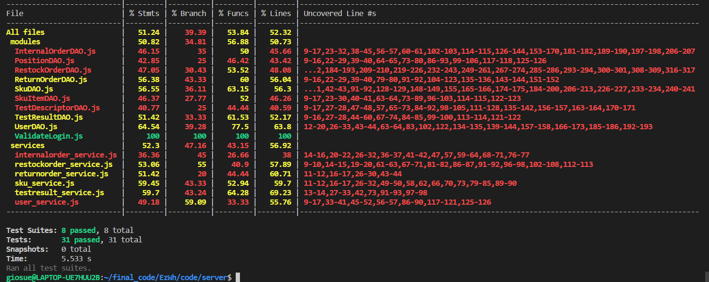

# Unit Testing Report

Date: 20/5/2022

Version: 2

# Contents

- [Black Box Unit Tests](#black-box-unit-tests)

- [White Box Unit Tests](#white-box-unit-tests)

# Black Box Unit Tests
 ### **Class *UserDAO* - method *newUser***

**Criteria for method *newUser*:**

- Validity of string username/email
- Existence of username/email
- Validity of string name
- Validity of string surname
- Validity of string password
- Validity of string role

**Predicates for method *newUser*:**

| Criteria | Predicate |
| -------- | --------- |
| Validity of string username/email | Valid |
|  | NULL |
| Existence of username/email | No |
|  | Yes |
| Validity of string name | Valid |
|  | NULL |
| Validity of string surname | Valid |
|  | NULL |
| Validity of string password | Valid |
|  | NULL |
| Validity of string role | Valid |
|  | NULL |

**Boundaries**:

| Criteria | Boundary values |
| -------- | --------------- |
|          |                 |

**Combination of predicates for method *newUser*:**:

 | Validity of string username /email | Existence of username /email | Validity of string name | Validity of string surname | Validity of string  password | Validity of string  role | Valid / Invalid | Description of the test case | JUnit test case |
|:----------------------------------:|------------------------------|-------------------------|----------------------------|------------------------------|--------------------------|-----------------|-------------------------------------------------------------------|-----------------|
| NULL  | * | *   | *    | *    | *    | Invalid  | user1= newUser(NULL,*,*,*,*) ->error 422 unprocessable entity     | testNewUser1()  |
| yes                                | Yes                          | yes                     | yes                        | yes                          | yes                      | Invalid         | user2=newUser(ezwh1,-,-,-,-)  -> error 409 conflict               | testNewUser2()  |
| yes                                | yes                          | yes                     | yes                        | yes                          | yes                      | Valid           | user3 = newUser(-,-,-,-,-) -> response header 201 created success | testNewUser3()  |
| yes                                | yes                          | yes                     | yes                        | yes                          | no                       | Invalid         | user4= newUser(-,-,-,-,-) -> error 401 unauthorized               | testNewUser4()  |

 ### **Class *UserDAO* - method *Cancel***

**Criteria for method *Cancel*:**

- Existence of username/email
- Validity of role (different that Admin/Manager)

 
**Boundaries**:

| Criteria | Boundary values |
| -------- | --------------- |
|          |                 |

**Predicates for method *Cancel*:**

| Criteria | Predicate |
| -------- | --------- |
| Exsistence of  username/email | yes |
|  | no |
| Validity of role | yes |
|  | no |
|

**Combination of predicates for method *Cancel***:
| Existence of username/email | Validity of role | Valid / Invalid | Description of the test case          | JUnit test case |
|-----------------------------|------------------|-----------------|---------------------------------------|-----------------|
| yes                         | yes              | Valid           | T1 cancel(ezwh3gmail.com , clerk) -> 204 sucess   | -   |
| yes                         | no               | Invalid         | T2 cancel (ezwh5@gmail.com, manager)->422 Unprocessable entity |-   |
| no                          | yes              | Invalid         | T3 cancel (ezwh6@gmail.com, clerk) ->422 Unprocessable entity   | -   |
| no                          | no               | Invalid         | T4 cancel (ezwh7@gmail.com , manager)-> 401 Unauthorized |-   |

 ### **Class *ItemDAO* - method *editItem***

**Criteria for method *editItem*:**

- Exsistence of id
- Validity of newDescription 
- Validity of  newPrice

**Predicates for method *editItem*:**

| Criteria | Predicate |
| -------- | --------- |
| Existence of id | No|
|  | Yes |
| Validity of newDescription | No |
|  | Yes |
| Validity of newPrice| No |
|  | Yes |

**Boundaries**:

| Criteria | Boundary values |
| -------- | --------------- |
|          |                 |

**Combination of predicates for method *newUser*:**:
| Existence of id | Validity of newDescription | Validity of newPrice | Valid / Invalid | Description of the test case                                                     | JUnit test case |
|-----------------|----------------------------|----------------------|-----------------|----------------------------------------------------------------------------------|-----------------|
| yes             | yes                        | yes                  | Valid           | (Item with id 1 was already created)  editItem(1,descrip1,34.7) -> sucess 200 ok | -               |
| no              | yes                        | yes                  | Invalid         | editItem(8,desc,20.5) -> error 404 not found                                     | -               |
| yes             | no                         | yes                  | Invalid         | editItem(1,NULL,23) -> error 422 validation of req body failed                   | -               |
| yes             | no                         | no                   | Invalid         | editItem(1,NULL,NULL) -> error 422 validation of req body failed                 | -               |

 ### **Class *ItemDAO* - method *deleteItem***

**Criteria for method *deleteItem*:**

- Exsistence of id

**Predicates for method *deleteItem*:**

| Criteria | Predicate |
| -------- | --------- |
| Existence of id | No|
|  | Yes |

**Boundaries**:

| Criteria | Boundary values |
| -------- | --------------- |
|          |                 |

**Combination of predicates for method *deleteItem*:**:
| Existence of id | Valid / Invalid | Description of the test case                                                 | JUnit test case |
|-----------------|-----------------|------------------------------------------------------------------------------|-----------------|
| yes             | Valid           | (Item with id 1 was already created)  deleteItem(1) -> sucess 204 no content | -               |
| no              | Invalid         | deleteItem(8) -> error 422 not Unprocessable entity validation of id failed  | -               |

 ### **Class *SkuDAO* - method *deleteSkuByID***

**Criteria for method *deleteSkuByID*:**

- Exsistence of  SKU id
- existence and validity of positionid

**Predicates for method *deleteSkuByID*:**

| Criteria | Predicate |
| -------- | --------- |
| Existence of id | No|
|  | Yes |

**Boundaries**:

| Criteria | Boundary values |
| -------- | --------------- |
|          |                 |

**Combination of predicates for method *deleteSkuByID*:**:
| Existence of id | Valid / Invalid | Description of the test case                                                 | JUnit test case |
|-----------------|-----------------|------------------------------------------------------------------------------|-----------------|
| yes             | Valid           | (SKU with id 7 was already created)  deleteSkuByID(7,6) -> sucess 204 no content | -               |
| no              | Invalid         | deleteSkuByID(8,6) -> error 422 not Unprocessable entity validation of id failed  | -               |

### **Class *SkuDAO* - method *getSkuByID***

**Criteria for method *getSkuByID*:**

- Exsistence of  SKU id

**Predicates for method *getSkuByID*:**

| Criteria | Predicate |
| -------- | --------- |
| Existence of id | No|
|  | Yes |

**Boundaries**:

| Criteria | Boundary values |
| -------- | --------------- |
|          |                 |

**Combination of predicates for method *deleteSkuByID*:**:
| Existence of id | Valid / Invalid | Description of the test case                                                 | JUnit test case |
|-----------------|-----------------|------------------------------------------------------------------------------|-----------------|
| yes             | Valid           | (SKU with id 7 was already created)  getSkuByID(7) -> sucess 200 ok | -               |
| no              | Invalid         | getSkuByID(8) -> error 404 not found no sku assosiated to id  | -               |

### **Class *SkuDAO* - method *editSku***

**Criteria for method *editSku*:**
- Existence of sku id
- Validity of string newdescription
- Validity of string newweight
- Validity of string newvolume
- Validity of string newprice
- Validity of string newAvailableQtty

**Predicates for method *editSku*:**

| Criteria | Predicate |
| -------- | --------- |
| Existence of sku id | No |
|  | Yes |
| Validity of string newdescription | No |
|  | Yes |
| Validity of string newweight | No |
|  | Yes |
| Validity of string newvolume | No |
|  | Yes |
| Validity of string newprice | No |
|  | Yes |
| Validity of string newAvailableQtty | No |
|  | Yes |

**Boundaries**:

| Criteria | Boundary values |
| -------- | --------------- |
|          |                 |

**Combination of predicates for method *editSku*:**:

| Existence of sku id | Validity of string  newdescription | Validity of string  newWeight | Validity of string   newVolume | Validity of string   newNotes | Validity of string  newPrice | Validity of string newAvailableQtty | Valid / Invalid | Description of the test case                                                   | JUnit test case |
|---------------------|------------------------------------|-------------------------------|--------------------------------|-------------------------------|------------------------------|-------------------------------------|-----------------|--------------------------------------------------------------------------------|-----------------|
| yes                 | yes                                | yes                           | yes                            | yes                           | yes                          | yes                                 | Valid           | editSku(7,"a new sku", 100,50,"first sku",10.99, 90) ->  200 ok sucess         | -               |
| no                  | yes                                | yes                           | yes                            | yes                           | yes                          | yes                                 | Invalid         | editSku(8, "zzz", 89, 89, "jjj",19.99, 89) -> 404 not found sku does not exist | -               |
| yes                 | no                                 | yes                           | yes                            | no                            | yes                          | yes                                 | Invalid         | editSku(7,NULL, 67, 67, NULL, 67.9, 99) ->error 422 unprocessable entity       | -               |
| yes                 | no                               | no                            | no                             | no                            | yes                          | yes                                 | Invalid         | editSku(7,"iii", NULL, NULL, NULL, 67.9, 99) ->error 422 unprocessable entity   

### **Class *SKUItemDAO* - method *getSkuItemBYRFID***

**Criteria for method *getSkuItemBYRFID*:**

- Exsistence of  rfid

**Predicates for method *getSkuItemBYRFID*:**

| Criteria | Predicate |
| -------- | --------- |
| Existence of rfid | No|
|  | Yes |

**Boundaries**:

| Criteria | Boundary values |
| -------- | --------------- |
|          |                 |

**Combination of predicates for method *getSkuItemBYRFID*:**:
| Existence of rfid | Valid / Invalid | Description of the test case                                                 | JUnit test case |
|-----------------|-----------------|------------------------------------------------------------------------------|-----------------|
| yes             | Valid           | (SKU item with id 12345678 was already created) getSkuItemBYRFID(12345678) -> sucess 200 ok | -               |
| no              | Invalid         | getSkuItemBYRFID(9637297) -> error 404 not found no sku item assosiated to rfid  | -      |

### **Class *SKUItemDAO* - method *deleteSkuItemByRFID***

**Criteria for method *deleteSkuItemByRFID*:**

- Exsistence of  SKU item rfid

**Predicates for method *deleteSkuItemByRFID*:**

| Criteria | Predicate |
| -------- | --------- |
| Existence of rfid | No|
|  | Yes |

**Boundaries**:

| Criteria | Boundary values |
| -------- | --------------- |
|          |                 |

**Combination of predicates for method *deleteSkuItemByRFID*:**:
| Existence of rfid | Valid / Invalid | Description of the test case                                                 | JUnit test case |
|-----------------|-----------------|------------------------------------------------------------------------------|-----------------|
| yes             | Valid           | (SKU with id 12345678 was already created)  deleteSkuItemByRFID(12345678) -> sucess no content 404 | -               |
| no              | Invalid         | deleteSkuItemByRFID(843547) -> error 422 unprocessable entity validation of rfid failed | -               |

### **Class *PositionDAO* - method *getPositions***

**Criteria for method *getPositions*:**

- Table in the DB with entries

**Predicates for method *getPositions*:**

| Criteria | Predicate |
| -------- | --------- |
|Table  with entries | empty |
|  |Full |

**Boundaries**:

| Criteria | Boundary values |
| -------- | --------------- |
|          |                 |

**Combination of getPositions**:

| Table  with entries| Valid / Invalid | Description of the test case | JUnit test case |
|-------|-------|-------|-------|
| empty  | Valid | getPositions() -> 200 ok will return a list of json objects position| - |
| full | Valid |getPositions() -> 200 ok will return an empty list  | - |

### **Class *TestDescriptorDAO* - method *deleteTestDescriptor***

**Criteria for method *deleteTestDescriptor*:**

- Exsistence of  TestDescriptor id

**Predicates for method *deleteTestDescriptor*:**

| Criteria | Predicate |
| -------- | --------- |
| Existence of id | No|
|  | Yes |

**Boundaries**:

| Criteria | Boundary values |
| -------- | --------------- |
|          |                 |

**Combination of predicates for method *deleteTestDescriptor*:**:
| Existence of rfid | Valid / Invalid | Description of the test case                                                 | JUnit test case |
|-----------------|-----------------|------------------------------------------------------------------------------|-----------------|
| yes             | Valid           |  deleteTestDescriptor(7) -> sucess no content 404 | -               |
| no              | Invalid         | deleteTestDescriptor(8) -> error 422 unprocessable entity validation of id failed | -               |

### **Class *InternalOrderDAO* - method *deleteInternalOrder***

**Criteria for method *deleteInternalOrder*:**

- Exsistence of  internal order id

**Predicates for method *deleteInternalOrder*:**

| Criteria | Predicate |
| -------- | --------- |
| Existence of id | No|
|  | Yes |

**Boundaries**:

| Criteria | Boundary values |
| -------- | --------------- |
|          |                 |

**Combination of predicates for method *deleteInternalOrder*:**:
| Existence of id | Valid / Invalid | Description of the test case                                                 | JUnit test case |
|-----------------|-----------------|------------------------------------------------------------------------------|-----------------|
| yes             | Valid           |   deleteInternalOrder(7) -> sucess 204 no content | -               |
| no              | Invalid         | deleteInternalOrder(8) -> error 422  Unprocessable entity validation of id failed  | -               |

### **Class *InternalOrderDAO* - method *getInternalOrderByID***

**Criteria for method *getInternalOrderByID***

- Exsistence of  id

**Predicates for method *getInternalOrderByID***

| Criteria | Predicate |
| -------- | --------- |
| Existence of id | No|
|  | Yes |

**Boundaries**:

| Criteria | Boundary values |
| -------- | --------------- |
|          |                 |

**Combination of predicates for method *getInternalOrderByID***
| Existence of id | Valid / Invalid | Description of the test case                                                 | JUnit test case |
|-----------------|-----------------|------------------------------------------------------------------------------|-----------------|
| yes             | Valid           | getInternalOrderByID(12) -> sucess 200 ok | -               |
| no              | Invalid         | getInternalOrderByID(13)  -> error 404 not found no internal order assosiated to id  | -      |

### **Class RestockOrderDAO - method *editState***
**Criteria for method *editState:***
 1. Exsistence of RO_ID

**Predicates for method *editState***
| Criteria | Predicate |
| -------- | --------- |
| Existence of RO_ID | No|
|  | Yes |

**Boundaries**: No boundaries, only boolean predicates to test

**Combination of predicates for method *editState***

|Existence of  RO_ID | Valid / Invalid | Description of the test case | Jest test case |
|-------|-------|-------|-------|
| YES | Valid | editState(7,Delivery)->200 OK (success)|-|
| NO | Invalid| editState(9,Issued) error->404 Not Found (no restock order associated to id) |-|

### **Class RestockOrderDAO - method *addTransportNote***
**Criteria for method *addTransportNote:***
 1. ROID existing
 2. State "DELIVERY"
 3. Transport note DeliveryDate >= restockOrder issueDate

**Predicates for method *addTransportNote***
| Criteria | Predicate |
| -------- | --------- |
| ROID existing  | YES   |
| ROID existing  |  NO   |
| State delivery | YES |
| State delivery | NO |
| Transport note DeliveryDate >= restockOrder issueDate | DeliveryDate < issueDate | 
| Transport note DeliveryDate >= restockOrder issueDate | DeliveryDate >= issueDate | 

**Boundaries**
| Criteria | Boundary values |
| -------- | --------- |
| Transport note DeliveryDate >= restockOrder issueDate  | DeliveryDate = issueDate |
| Transport note DeliveryDate >= restockOrder issueDate  | DeliveryDate = new Date(-8640000000000000).toUTCString() // Tue, 20 Apr 271,822 B.C. 00:00:00 UTC |
| Transport note DeliveryDate >= restockOrder issueDate  | DeliveryDate = new Date(8640000000000000).toUTCString() // Sat, 13 Sep 275,760 00:00:00 UTC 00:00:00 UTC |

**Combination of predicates for method *addTransportNote***

| ROID existing | State delivery | DeliveryDate >= issueDate | Valid / Invalid | Description of the test case                                                                                                                                                                                                                                                                                             | Jest test case |
|---------------|----------------|---------------------------|-----------------|--------------------------------------------------------------------------------------------------------------------------------------------------------------------------------------------------------------------------------------------------------------------------------------------------------------------------|----------------|
| YES           | YES            | YES                       | YES             | Creates a restockOrder, updates a restockOrder given a correct ID with a DELIVERY state, inserts a transportNote whose DeliveryDate >= issueDate (boundaries to test are deliveryDate = issueDate, and deliveryDate = maxDate): in all the cases the function expects to find the same restockOrder with a transportNote | -              |
| YES           | YES            | NO                        | NO              | Inserts a transportNote whose DeliveryDate < issueDate (boundary to test: DeliveryDate = minDate): expects to catch a 'Delivery before issue' exception                                                                                                                                                                  | -              |
| YES           | NO             | ...                       | NO              | Tries to insert a transportNote in a restockOrder having state != DELIVERY: expects to catch a 'Not DELIVERY state' exception                                                                                                                                                                                            | -              |
| NO            | ...            | ...                       | NO              | Tries to insert a transportNote in a non existing restockOrder: should catch an 'ID not found' exception                                                                                                                                                                                                                 | -              |
# White Box Unit Tests

### Test cases definition
    

  **Note:** The arguments of the test functions have not been listed below, only their names.
| Unit name | Jest test case |
|--|--|
|UserDAO|testNewUser testGetAllUsers testGetUserInfo testGetAllUsers  testGetSuppliersTrue  testGetSuppliersFalse  testLogin testModifyRights ||
|Validate Login|testValidateLogin |
|SKU Service|testNewSku testEditSku |
|Internal Order Service|testNewInternalOrder   testEditInternalOrder |

### Code coverage report

